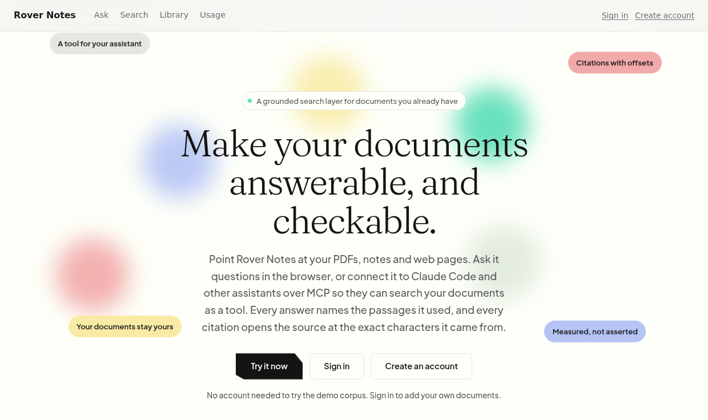

# Rover Notes

> Notes, chunked and retrieved, questions answered with citations.

                     



Rover Notes turns a collection of documents into a searchable knowledge base that answers
questions and shows its sources. Point it at PDFs, Markdown files, notes you write in the
browser, or the address of a web page. Ask a question and the answer arrives with numbered
citations; click one and the source document opens at the exact characters the claim came
from.

The same retrieval is exposed over **MCP**, so Claude Code and other AI assistants can
search your documents as one of their tools and quote them accurately.

---

## Demo

A walkthrough covers the system end to end: a question answered with citations
that open the source at the exact span they name, the same library reached over MCP from
Claude Code, the two retrieval channels and the ranking that fuses them, and a PDF and a
web page being ingested.

<!-- PLACEHOLDER: drag-and-drop docs/media/rover-notes-demo.mp4 into this file in the
     GitHub web editor, then delete this comment and the line below it — GitHub will
     replace the dropped file with a user-attachments URL that renders as an inline,
     playable video. -->
<!-- Paste the GitHub-generated video URL on its own line, here. -->

---

## What it does

**Finds passages two ways at once.** Every chunk is embedded for meaning and indexed for
words. A question runs against both channels and the two rankings are fused, so a
paraphrase and an exact identifier are both retrieved. The channels fail on different
queries: embeddings lose rare tokens, word matching loses paraphrase. Retaining both
covers the range. The per-channel comparisons, including where fusion does not win, are in
[docs/RESULTS.md](docs/RESULTS.md).

**Answers only from what it retrieved.** The model receives the selected passages and
nothing else. Over the eight questions in the evaluation set the corpus cannot answer, it
declines all eight.

**Makes every claim checkable.** A citation is a character range in a document, not a
filename, which is what lets the interface open a source at the exact span.

**Keeps separate subjects apart, without hiding anything.** A document can be filed under a
topic, and the library can be narrowed to one. Search and answers stay across the whole
corpus, since a question is usually asked without knowing which topic holds the answer.

**Measures whether each addition helps.** Retrieval changes are recorded with a measured
delta and a paired significance test. A change that does not clear the gate is not
adopted, and several that were built were dropped on that basis. See [docs/RESULTS.md](docs/RESULTS.md).

---

## Quick start

```bash
cp .env.example .env         # fill in ANTHROPIC_API_KEY, mail and key settings
make up                      # Postgres + pgvector, MinIO, TEI embed + rerank
make api                     # Spring Boot on :8080, applies migrations on startup
make web                     # Next.js on :3000
```

`make` sources `.env` into the processes it starts. Running Gradle directly does not, so
export it first (`set -a; . ./.env; set +a`) or use the make target.

Uploading a PDF or clipping a web page also needs the Python service, which does the
parsing:

```bash
make ml                      # FastAPI on :8000, with the parsing extra installed
```

Two dependencies are worth knowing about, because nothing fails until the feature is used:

- **The parsing extra.** `make ml` installs it. Without it the service runs normally and
  answers **501** on `/parse/pdf` and `/parse/url`, naming the missing extra.
- **Tesseract**, for scanned PDFs. A system package: `apt install tesseract-ocr` or
  `brew install tesseract`. Without it a scan yields no text, and the response names the
  pages affected.

`make api` runs the `local` profile, which attributes every request to a fixed development
owner, so the endpoints answer without anyone signing in:

```bash
curl -X POST localhost:8080/api/notes -H 'content-type: application/json' \
  -d '{"title":"Retrieval","content":"RRF fuses ranked lists by position."}'

curl 'localhost:8080/api/search?q=how+are+ranked+lists+combined'

curl -X POST localhost:8080/api/ask -H 'content-type: application/json' \
  -d '{"question":"How are ranked lists combined?"}'

curl -N -X POST localhost:8080/api/ask/stream -H 'content-type: application/json' \
  -d '{"question":"How are ranked lists combined?"}'   # citations first, then the answer
```

Every model call writes a row to `llm_usage`, so spend is measured rather than estimated.
`GET /api/usage` reports it over the same window the spend cap is enforced against.

To connect an AI assistant, see [mcp/README.md](mcp/README.md). To deploy it to
Azure, see [infra/README.md](infra/README.md).

---

## Architecture

```
Next.js                 frontend and auth session handling, no business logic
        │ REST + SSE
        ▼
Spring Boot 4.1         modular monolith (Spring Modulith 2.1, Java 21, virtual threads)
  ├─ notes              documents, CRUD, outbox
  ├─ ingestion          parse → chunk → embed → index
  ├─ retrieval          dense + lexical + RRF fusion + rerank
  ├─ agent              retrieve-then-generate, blocking and streamed
  ├─ identity           OAuth 2.1 with PKCE, Argon2id
  ├─ usage              per-request cost attribution and spend caps
  └─ mcp                search, get_document, list_documents
        │
        ├──────────────► ml-service (Python)  embeddings, reranking, PDF and web parsing
        │
        ▼
PostgreSQL 17
  ├─ pgvector (HNSW)    dense retrieval
  ├─ tsvector           lexical channel
  ├─ pg_trgm            identifier and filename matching
  ├─ outbox             SKIP LOCKED job queue
  └─ llm_usage          per-request cost attribution

Object storage         original uploaded files (MinIO locally, Azure Blob in a deployment)
```

One Postgres does vector, full-text and queue work. A document and its indexing job commit
in the same transaction, so there is no dual-write to reconcile. Design decisions and the
measurements behind them are in [docs/ARCHITECTURE.md](docs/ARCHITECTURE.md).

---

## The retrieval pipeline

```
query
  │
  ├─ ROUTE ────────── single-token identifier queries go to the lexical channel
  ├─ CANDIDATES ───── dense (HNSW, top-100) ∥ lexical (top-100)
  ├─ FUSE ─────────── Reciprocal Rank Fusion, k=60
  └─ RERANK ───────── late interaction over the top 40, on request
```

**Routing** sends single-token, identifier-shaped queries to the lexical channel, falling
back to fusion if that channel returns nothing. Embeddings compress a rare token into
general topical meaning, so the dense channel averages 0.6965 nDCG@10 on identifiers
against 0.9710 for lexical. Routing is worth **+0.0483 nDCG@10** on the known-item slice
and **+0.1573** on held-out identifiers, at a cost of +0.0016 on the semantic set.

**Reranking** scores the top 40 candidates by MaxSim against a ColBERT model, which keeps
one vector per token on both sides. On SciFact this is worth **+0.0510 nDCG@10**
(95% CI +0.0291 to +0.0734). It costs 7.7 s at p95, so it is available per query and off by
default; a cross-encoder remains selectable and is a third of the cost.

---

## Measured results

Every figure comes from a command in this repository. Full method and the experiments that
did not work are in [docs/RESULTS.md](docs/RESULTS.md).

| What | Result |
|---|---|
| Retrieval quality, SciFact (5,183 abstracts, 300 claims) | **nDCG@10 0.7324** with late-interaction reranking |
| Retrieval quality, 42-document corpus (128 queries) | **nDCG@10 0.8254**, recall@5 0.9297 |
| Answer faithfulness | **0.9688**, citation precision **0.9723** |
| Abstention on unanswerable questions | **8 of 8** |
| Retrieval p95, serial | **32 ms** before the model call |
| Retrieval p95, 10 concurrent | **94 ms** |
| Cost per answer | **$0.0149** Sonnet 5, **$0.0036** Haiku 4.5 |
| Rate-limit check, per request | **0.596 ms** median |
| Test suites | **447 JVM**, 223 Python, 56 browser |

The [demo](#demo) shows these paths end to end: a note written, found by search, and
answered with citations.

---

## Security

The corpus is user-owned content, and one route into the system fetches a web page the
caller names, so attacker-controlled input is expected rather than exceptional.

**Retrieved text is framed as data.** Passages reach the model inside `<passage>` blocks,
and a passage cannot close its own block or open another. Both system prompts state that
content between the tags is never an instruction, and the MCP tool descriptions repeat it,
so a connected client inherits the warning.

**Every query is scoped to an owner, and the owner fails closed.** Retrieval filters on
`owner_id` in SQL. The endpoint serving an uploaded file resolves the document as its owner
before object storage is asked for anything. Object keys are `{ownerId}/{documentId}`, both
UUIDs, so an uploaded filename never reaches a path.

**URL fetching is treated as server-side request forgery.** Every address a hostname
resolves to is checked, addresses that are not globally routable are refused, and every
redirect hop is re-checked.

**Credentials.** Argon2id at the OWASP baseline behind a `DelegatingPasswordEncoder`.
Sign-in is OAuth 2.1 with PKCE; the access token is held in memory only, and no refresh
token is issued to a public client.

**The development profile cannot start against a deployment.** `DeploymentGuard` refuses to start
the application when that profile is active alongside a non-loopback issuer.

**Defaults deny.** The filter chain ends in `denyAll()`. Responses carry a content security
policy of `default-src 'none'`.

**Dependencies are monitored.** `npm audit` and `pip-audit` gate CI at high severity.
Dependabot raises alerts and opens a pull request when a dependency has a published
vulnerability. Routine version bumps are disabled, so a branch is created only for a
security update.

---

## Testing

```bash
make gate          # what a commit is checked against: build, tests, lint, types
make test          # JVM suite, against real Postgres via Testcontainers
make web-test      # browser tests, needs a running API
make eval          # retrieval quality against the golden set
```

CI runs five jobs on dispatch and on pull requests. The retrieval gate tests significance
against a committed baseline, so a change that moves the mean without clearing the interval
does not pass.

---

## Repository layout

```
api/              Spring Boot modular monolith
ml-service/       Python: embeddings, reranking, parsing, evaluation harness
web/              Next.js frontend
mcp/              MCP client configuration and an acceptance check
evals/            Test corpus, golden sets, baselines. See evals/README.md
infra/            Azure deployment: Bicep, deploy and teardown. See infra/README.md
load/             k6 load script behind the latency figures
demo/             seeds a running instance with a small library, for demonstrations
docs/
  ARCHITECTURE.md Design decisions and the measurements behind them
  RESULTS.md      Retrieval and generation quality, with confidence intervals
```

---

## Current limitations

- **Retrieval latency at load.** The p95 target of 150 ms holds serially and to about ten
  concurrent users. At twenty it reaches 183–273 ms with no errors. The embedding call is
  159 ms of a 169 ms request under that load; the retrieval SQL is 8.5 ms.
- **Reranking is off by default.** Both rerankers are well outside the latency budget, so
  reranking is requested per query.
- **The deployment has not been run end to end.** The Azure template in
  [`infra/`](infra) compiles, the three container images build, and every environment
  variable it sets has been checked against what the application actually reads. The
  stack has not yet been provisioned against a live subscription.
- **Single-node.** Postgres does vector, full-text and queue work on one instance. The
  thresholds at which each part would be separated are documented alongside the decisions.

---

## License

[MIT](LICENSE), © 2026 Akshay Madavalappil Ramesh.

The evaluation corpus under `evals/corpus/` is covered by the same terms. SciFact, which
`make eval-scifact-build` downloads into `evals/corpus-scifact/`, is not redistributed here
and carries its own licence from [BEIR](https://github.com/beir-cellar/beir).
